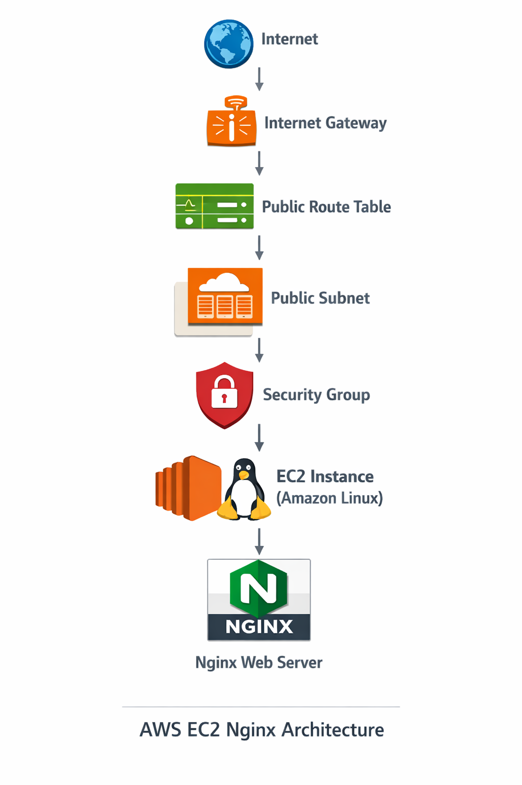

# 🚀 AWS Terraform Infrastructure Deployment

A production-style Infrastructure as Code (IaC) project demonstrating how to provision AWS infrastructure using **Terraform**. This project automates the deployment of a custom Virtual Private Cloud (VPC), networking components, security groups, and an EC2 instance running an Nginx web server.

---

## 📌 Project Overview

This project showcases how Terraform can be used to automate AWS infrastructure deployment instead of manually creating resources through the AWS Management Console.

The infrastructure includes:

* Custom VPC
* Public Subnet
* Internet Gateway
* Route Table
* Security Group
* EC2 Instance
* Automated Nginx installation using User Data

---

## 🛠 Technologies Used

* Terraform
* AWS EC2
* AWS VPC
* Internet Gateway
* Route Table
* Security Groups
* Amazon Linux 2
* Nginx
* AWS CLI

---

## 🏗 Architecture



---

## 📂 Project Structure

```text
AWS-Terraform-Infrastructure/
│
├── images/
│   ├── architecture.png
│   ├── terraform-init-success.png
│   ├── terraform-plan-success.png
│   ├── terraform-apply-success.png
│   ├── ss4-ec2-instance-running.png
│   ├── ss5-vpc-created.png
│   ├── terraform-public-subnet.png
│   ├── terraform-public-rt.png
│   ├── terraform-igw.png
│   ├── ss7-security-group-rules.png
│   ├── ss8-live-website.png
│   ├── terraform-state-list.png
│   └── terraform-web-sg.png
│
├── main.tf
├── variables.tf
├── outputs.tf
├── terraform.tfvars
├── terraform.tfvars.example
├── .gitignore
└── README.md
```

---

# 🚀 Deployment Steps

## 1. Initialize Terraform

```bash
terraform init
```

### Screenshot


---

## 2. Validate Configuration

```bash
terraform validate
```

---

## 3. Review the Execution Plan

```bash
terraform plan
```

### Screenshot


---

## 4. Deploy Infrastructure

```bash
terraform apply
```

Type:

```text
yes
```

### Screenshot


---

# ☁ AWS Resources Created

## Custom VPC


---

## Public Subnet


---

## Internet Gateway


---

## Public Route Table


---

## Security Group


---

## Web Server Security Group


---

## EC2 Instance Running


---

# 🌐 Live Application

Terraform automatically installs **Nginx** using the EC2 User Data script.

After deployment, accessing the EC2 Public IP displays the default Nginx web page.

### Screenshot


---

# 📄 Terraform State

Terraform keeps track of infrastructure using the state file.

### Screenshot


---

# 📁 Files Included

* main.tf
* variables.tf
* outputs.tf
* terraform.tfvars
* terraform.tfvars.example
* .gitignore
* README.md

---

# 🔒 Security Best Practices

The following files are intentionally excluded from GitHub:

* `terraform.tfvars`
* `.terraform/`
* `terraform.tfstate`
* `terraform.tfstate.backup`
* `*.pem`

This is managed through the `.gitignore` file.

---

# 📚 Key Terraform Concepts Demonstrated

* Infrastructure as Code (IaC)
* Terraform Providers
* Variables and Outputs
* Resource Dependencies
* AWS Networking
* EC2 Provisioning
* User Data Automation
* State Management
* Security Groups
* Modular Infrastructure Design

---

# 📸 Project Outcome

✔ Infrastructure deployed using Terraform

✔ Custom AWS networking created automatically

✔ EC2 instance provisioned successfully

✔ Nginx installed automatically via User Data

✔ Web application accessible through Public IP

✔ Infrastructure fully reproducible using Terraform

---

## 👨‍💻 Author

**Jeet Zala**

AWS Cloud Portfolio Project 6 – Terraform Infrastructure Deployment

